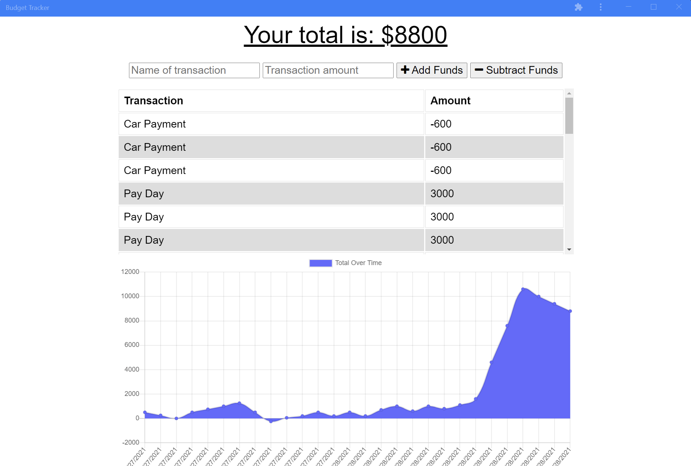

   
  # Budget Analysis and Visualizer 
  ## **Description**
  This project was an integration of progressive web application (PWA) principles along with storage and caching technologies using IndexedDB and Service Workers. In situations where data persistence and lossless submission is critical, no other application of IndexedDB is more crucial then a finance application, while providing a seamless experience for the user when they may be at their most stressed with the integration of service workers.

  Get piece of mind when budgeting your finances with this simple yet powerful app!

 

## Click the image to visit Baav!

  ---

  ## **Table of Contents**
  * [Installation](#installation)
    * [Desktop](#desktop)
    * [IOS](#ios)
  * [Usage](#usage)
    * [Disclaimer](#disclaimer)
  * [Credits](#credits)
  * [License(s)](#license)
  * [Contributers](#contributers)
  * [Questions](#questions)
   
---

## **Installation**
---
###    **Desktop**
---

Navigate to [https://baav.herokuapp.com/](https://baav.herokuapp.com/). Since the application meets the critieria as a progressive web application, simply select the 'Install Budget Analysis and Visualizer' button which is located on the right side of the URL bar.

Confirm the Installation

The application will now appear as an application on your desktop. By default, the application should install on your desktop. 

---
### **IOS**
---

Navigate to [https://baav.herokuapp.com/](https://baav.herokuapp.com/) in your Safari browser. Since the application meets the critieria as a progressive web application, simply select the 'Share Button' button which is located at the very bottom center of your browser.

Once you select the share button, scroll down to the portion of the menu that displays selectable actions, select, 'Add to Home Screen', and confirm the next dialogue box.

The application should appear as your last installed app on IOS. Selecting it will display a clean interface, which persist from the main website itself. 

You now have access to the same information as if directly acessing it from the website. 

## Time to keep track of your budget!
---

## **Usage**

---

### Disclaimer
---

  >**\*\*DISCLAIMER\*\*** 
    The application cannot differenciate between unique users visiting the site, and all the data is currently pooled, do not use this as a personal/business or any serious financial application. I am not responsible for any financially irresponsible behavior from the user **
   **\*\*DISCLAIMER\*\***

---

To use this application, navigate to the homepage or click [here](https://baav.herokuapp.com/). You are presented with a list of previous transactions, a total value of current transactions and a graphic of your transactions. 

To complete a transaction, start by labeling the transaction in the box on the left, and enter an amount in the box on the right. You can add or remove funds by selecting the appropriate button on the far right. 

We decided to add money to our funds, but  during that time, our internet had gone offline! With Baav, the application's data will not be lost and the transaction will be held in the IndexedDB database. 

We can see the value has been stored in a key value database on our browswer despite the internet outage! Using the power of service workers, the entire app has been cached on our browser storage, so that we can continue to use it.

Once Internet connectivity has been restored, an alert will appear notifying the user. Once the notification has been cleared by selecting 'OK', the page will refresh with the data returning from the database, as opposed to the indexed data. 

Remember not to access the application from more then one place at a time. An error may occur where the data will index for each instance of the website open. We can see due to multiple tabs, as well as the running desktop application, we have tripled our IndexedDB calls for every instance that was live! More is in the works to optimize this on a user by user experience, eliminating the chances of this happening in the future. 

Although we are missing the critical redirect to HTTPS criteria to ensure end to end encryption, that is a simple fix by implementing Heroku's Hobby level SSL certificates. Given the simplicity of the project, I chose not to implement it. But you're sure to arrive at a well optimized site meeting all the criterias maining the highest level of standards for performance, accessibility, best practices and search engine optimization. 

  ---

## **Credits**
  Hamzah Ullah

  ---

## **License**
  1 license used:
 [MIT](https://choosealicense.com/licenses/mit/)
 

  ---

## **Contributers**
   Contributing to the Project is Restricted 

  ---

## **Questions?**

### **Github**
  [Repository](https://github.com/brobro10000)

  [Personal Page](https://brobro10000.github.io)

  If you have any questions, you can reach me at <hamzahullah@gmail.com>
